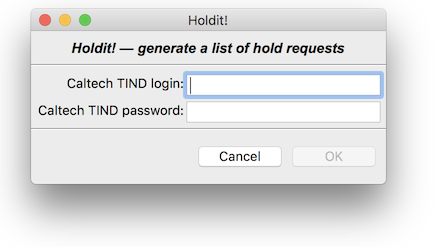

Holdit!
======

_Holdit!_ is a small application written for the Caltech Library's Circulation team to easily generate a printable "on hold" book list from the Caltech TIND server.

*Authors*:      [Michael Hucka](http://github.com/mhucka)<br>
*Repository*:   [https://github.com/caltechlibrary/urlup](https://github.com/caltechlibrary/@@REPO@@)<br>
*License*:      BSD/MIT derivative &ndash; see the [LICENSE](LICENSE) file for more information

☀ Introduction
-----------------------------

The Caltech Library's Circulation Desk handles, among other things, requests by patrons to put books or other materials on hold.  However, the catalog management software does not have a simple way to produce a printable list of items to hold.  The staff who go to the stacks to find materials have to look up the information from the LIMS system used by Caltech (TIND), write the information on paper, and update a Google spreadsheet used to track requests.

_Holdit!_ is aimed at automating more of this procedure to reduce frustration and possible errors.  It uses Shibboleth to log in to the Caltech Library system, scrapes TIND to get the necessary information, produces a printable document (based on a customizable template), and updates the Google spreadsheet used to track holds.

✺ Installation instructions
---------------------------

The following is probably the simplest and most direct way to install this software on your computer:
```sh
sudo pip3 install git+https://github.com/caltechlibrary/holdit.git
```

Alternatively, you can clone this GitHub repository and then run `setup.py`:
```sh
git clone https://github.com/caltechlibrary/holdit.git
cd holdit
sudo python3 -m pip install .
```

▶︎ Basic operation
------------------



_Holdit!_ has both a GUI interface and a command-line interface.  The GUI interface is simple: a user starts the program in a typical way (e.g., by double-clicking the program icon) and it asks for login credentials for Caltech.tind.io. The image at right depicts the first dialog. After the user types in a login name and password, and clicks the **OK** button, the program does the following behind the scenes:

1. Searches Caltech.tind.io for the most recent hold requests
2. Scrapes the HTML page returned by the TIND search
3. Downloads the Google spreadsheet used by the Circulation staff
4. Compares the two data sources to determine if the TIND search returned new holds
5. Adds any new hold requests to the Google spreadsheet
6. Creates a Word document listing the latest hold requests (if any)
7. Opens the Word document so that the user can print it

_Holdit!_ presents only one other dialog: to ask the user whether the Google spreadsheet should be opened in a browser window.  If the user clicks the **Yes** button, it's opened.  Either way, _Holdit!_ exits after the user answers the dialog.

The Word document is created from a template Word file unimaginatively named `template.docx`, which _Holdit!_ looks for in the same folder where the program is found.  Users can modify the look and content of the template as they wish in order to customize the format of the printed hold sheets.  Variables used in the template are indicated by surrounding special terms with `{{` and `}}`; these then get substituted by _Holdit!_ when it generates the printable document.  The following table lists the recognized variables:

| Variable | Meaning |
|----------|---------|
| `{{item_title}}` | The title of the book or other item to be held |
| `{{item_details_url}}` | The URL to the "item details" page in Caltech.tind.io |
| `{{item_record_url}}` | The URL to the record editing/update page in Caltech.tind.io | 
| `{{item_call_number}}` | The item's call number |
| `{{item_barcode}}` | A barcode assigned to every item |
| `{{item_location_name}}` | The campus library building where the item is located |
| `{{item_location_code}}` | A code name for the campus library building location |
| `{{item_loan_status}}` | The current status of the item, whether on loan, etc. |
| `{{item_loan_url}}` | The status page for the item's loan status | 
| `{{date_requested}}` | The date the hold request was made | 
| `{{date_due}}` | The date a held item is due back |
| `{{date_last_notice_sent}}` | The date of the most recent reminder notice sent to the patron |
| `{{overdue_notices_count}}` | How many notices have been sent |
| `{{holds_count}}` | How many holds exist on the item |
| `{{requester_name}}` | The name of the patron who requested the hold |
| `{{requester_type}}` | The type of patron (student, faculty, etc.) |
| `{{requester_url}}` | The URL of an information page about the patron |
| `{{caltech_status}}` | The item's status indication in the Google spreadsheet |
| `{{caltech_staff_initials}}` | Who handled the hold request |
| `{{current_date}}` | Today's date; i.e., the date when Holdit! generates the hold list |
| `{{current_time}}` | Now; i.e., the the time when when Holdit! generates the hold list |


✎ Configuration
--------------

For security reasons, the files checked into the repository do not include all the data necessary to run Holdit!  Two things need to be done before Holdit! can be run from a command line or a working binary can be created.

1. The value of `spreadsheet_id` in the file [holdit/holdit.ini](holdit/holdit.ini) must be set to the correct Google spreadsheet identifier.  (Namely, the identifier of the spreadsheet used by the Caltech Library circulation group to track holds.)
2. A `credentials.json` file must be placed in the directory where Holdit! is installed or executed from. This `credentials.json` file needs to contain the OAuth credentials from Google to access the spreadsheet via the Google API.


⁇ Getting help and support
--------------------------

If you find an issue, please submit it in [the GitHub issue tracker](https://github.com/caltechlibrary/holdit/issues) for this repository.


☺︎ Acknowledgments
-----------------------

The vector artwork used as a logo for Holdit was created by [Yo! Baba](https://thenounproject.com/vectormarket01/) and obtained from the [Noun Project](https://thenounproject.com/search/?q=hold&i=1022878).  It is licensed under the Creative Commons [CC-BY 3.0](https://creativecommons.org/licenses/by/3.0/) license.


☮︎ Copyright and license
---------------------

Copyright (C) 2018, Caltech.  This software is freely distributed under a BSD/MIT type license.  Please see the [LICENSE](LICENSE) file for more information.
    
<div align="center">
  <a href="https://www.caltech.edu">
    
  </a>
</div>
