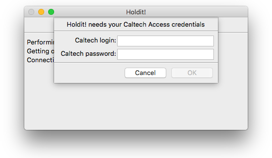
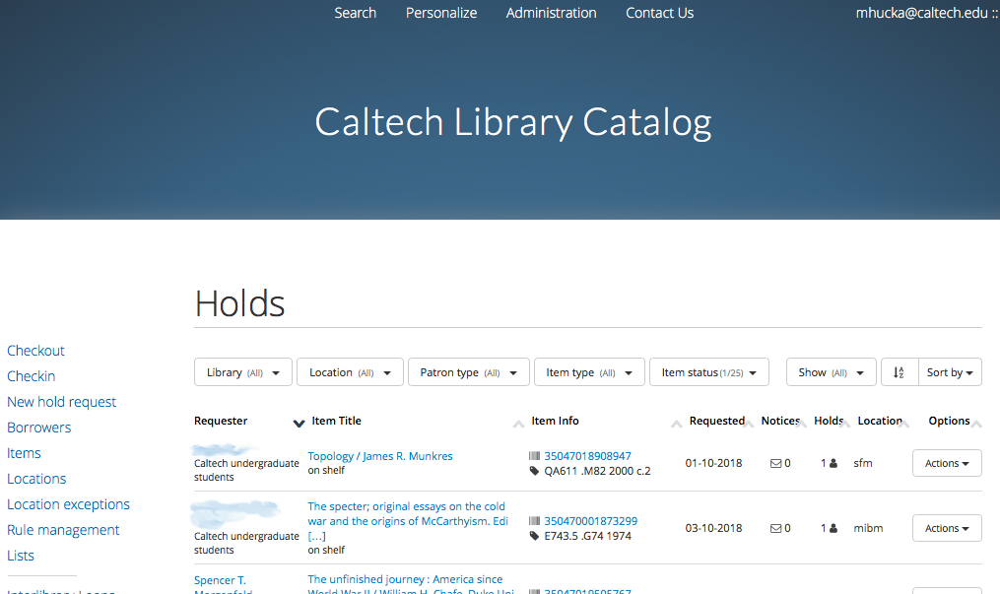
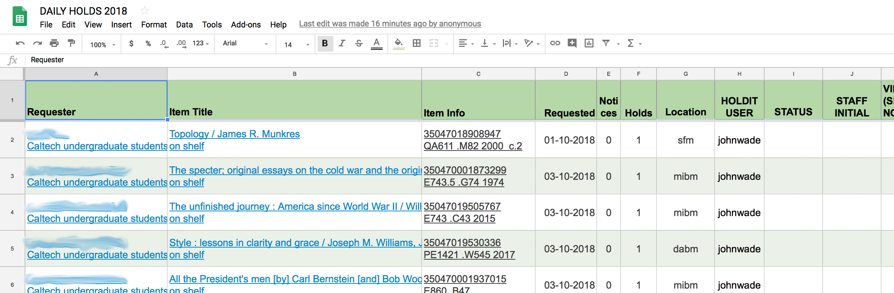
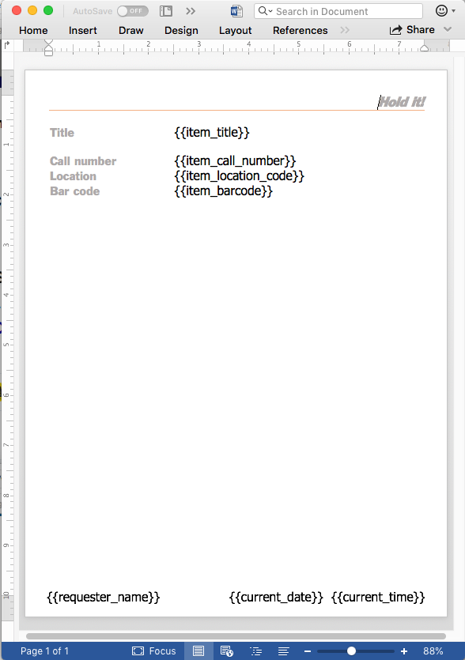

Hold It!
======

_Hold It!_ is an application written for the Caltech Library's Circulation team to easily generate a printable "on hold" book list from the Caltech TIND server.

*Authors*:      [Michael Hucka](http://github.com/mhucka) 
*Repository*:   [https://github.com/caltechlibrary/holdit](https://github.com/caltechlibrary/holdit) 
*License*:      BSD/MIT derivative &ndash; see the [LICENSE](LICENSE) file for more information

Table of Contents
-----------------
* [Introduction](#-introduction)
* [Installation instructions](#-installation-instructions)
* [Basic operation](#︎-basic-operation)
* [Configuration](#-configuration)
* [Getting help and support](#-getting-help-and-support)
* [Do you like it?](#-do-you-like-it)
* [Acknowledgments](#︎-acknowledgments)
* [Copyright and license](#︎-copyright-and-license)

☀ Introduction
-----------------------------

The Caltech Library's Circulation Desk handles, among other things, requests by patrons to put books or other materials on hold.  However, the catalog management software does not have a simple way to produce a printable list of items to hold.  The staff who go to the stacks to find materials have to look up the information from the information management system used by Caltech (TIND), write the information on paper, and update a Google spreadsheet used to track requests.

_Hold It!_ is aimed at automating more of this procedure to reduce frustration and possible errors.  It uses Shibboleth to log in to the Caltech Library system, scrapes TIND to get the necessary information, produces a printable document (based on a user-customizable template), and updates the Google spreadsheet used to track holds.

✺ Installation instructions
---------------------------

The developers provide an installer program for Caltech Library users.  Please contact the developers to get a copy of the installer program for Windows 7, Windows 10, or macOS 10.12+.  Note also that installation of _Hold It!_ on Windows requires administrator priviledges.

You can also build _Hold It!_ from sources.  Information about building the application can be found in the project [Wiki](https://github.com/caltechlibrary/holdit/wiki).

▶︎ Basic operation
------------------

_Hold It!_ has both a GUI interface and a command-line interface.  The GUI interface is simple: a user starts the program in a typical way (e.g., by double-clicking the program icon) and _Hold It!_ creates a main window, then immediately begins its work by connecting to Caltech.tind.io and asking the user for login credentials.  The image at right depicts the first dialog. After the user types in a login name and password, and clicks the **OK** button, the program does the following behind the scenes:

1. Searches Caltech.tind.io for the most recent hold requests
2. Scrapes the HTML page returned by the TIND search
3. Downloads the Google spreadsheet used by the Circulation staff
4. Compares the two data sources to determine if the TIND search returned new holds
5. Adds any new hold requests to the Google spreadsheet
6. Creates a Word document listing the latest hold requests (if any)
7. Opens the Word document so that the user can print it

"New holds" are determined in the following way: _Hold It!_ searches the circulation holds list in caltech.tind.io for items with status code 24 (which is the item status "on shelf") and status code 7 (which is the item status "lost"), compares their bar codes and request dates against all entries found in the Google spreadsheet, and writes out the records that are in caltech.tind.io but not in the spreadsheet.  The assumption is that when a circulation desk staff processes a hold, they will change that item's status in caltech.tind.io, and thus the search will no longer retrieve it.

Unless an error occurs, _Hold It!_ presents only one other dialog: to ask the user whether the Google spreadsheet should be opened in a browser window.  If the user clicks the **Yes** button, it's opened.  Either way, _Hold It!_ exits after the user answers the dialog.

The Word document is created from a template Word file named `template.docx`, which _Hold It!_ looks for in the same folder where the _Hold It!_ program itself is found.  (E.g., on Windows this might be `C:\Program Files\Hold It` or wherever the user installed the application.)

Users can modify the look and content of the template as they wish in order to customize the format of the printed hold sheets.  Variables used in the template are indicated by surrounding special terms with `{{` and `}}`; these then get substituted by _Hold It!_ when it generates the printable document.  The following table lists the recognized variables:

| Variable | Meaning |
|----------|---------|
| `{{item_title}}` | The title of the book or other item to be held |
| `{{item_details_url}}` | The URL to the "item details" page in Caltech.tind.io |
| `{{item_record_url}}` | The URL to the record editing/update page in Caltech.tind.io | 
| `{{item_call_number}}` | The item's call number |
| `{{item_barcode}}` | A barcode assigned to every item |
| `{{item_location_name}}` | The campus library building where the item is located |
| `{{item_location_code}}` | A code name for the campus library building location |
| `{{item_loan_status}}` | The current status of the item, whether on loan, etc. |
| `{{item_loan_url}}` | The status page for the item's loan status | 
| `{{date_requested}}` | The date the hold request was made | 
| `{{date_due}}` | The date a held item is due back |
| `{{date_last_notice_sent}}` | The date of the most recent reminder notice sent to the patron |
| `{{overdue_notices_count}}` | How many notices have been sent |
| `{{holds_count}}` | How many holds exist on the item |
| `{{requester_name}}` | The name of the patron who requested the hold |
| `{{requester_type}}` | The type of patron (student, faculty, etc.) |
| `{{requester_url}}` | The URL of an information page about the patron |
| `{{caltech_status}}` | The item's status indication in the Google spreadsheet |
| `{{caltech_staff_initials}}` | Who handled the hold request |
| `{{current_date}}` | Today's date; i.e., the date when _Hold It!_ generates the hold list |
| `{{current_time}}` | Now; i.e., the the time when when _Hold It!_ generates the hold list |

✎ Configuration
--------------

For security reasons, the files checked into the repository do not include all the data necessary to run _Hold It!_  Two things need to be done before _Hold It!_ can be run from a command line or a working binary can be created.

1. The value of `spreadsheet_id` in the file [holdit/holdit.ini](holdit/holdit.ini) must be set to the correct Google spreadsheet identifier.  (Namely, the identifier of the spreadsheet used by the Caltech Library circulation group to track holds.)
2. A `credentials.json` file must be placed in the directory where _Hold It!_ is installed or executed from. This `credentials.json` file needs to contain the OAuth credentials from Google to access the spreadsheet via the Google API.

More general information about building the _Hold It!_ application can be found in the project [Wiki](https://github.com/caltechlibrary/holdit/wiki) on GitHub.

⁇ Getting help and support
--------------------------

If you find an issue, please submit it in [the GitHub issue tracker](https://github.com/caltechlibrary/holdit/issues) for this repository.

★ Do you like it?
------------------

If you like this software, don't forget to give this repo a star on GitHub to show your support!

☺︎ Acknowledgments
-----------------------

The vector artwork used as part of the logo for _Hold It!_ was created by [Yo! Baba](https://thenounproject.com/vectormarket01/) and obtained from the [Noun Project](https://thenounproject.com/search/?q=hold&i=1022878).  It is licensed under the Creative Commons [CC-BY 3.0](https://creativecommons.org/licenses/by/3.0/) license.

_Hold It!_ makes use of numerous open-source packages, without which it would have been effectively impossible to develop _Hold It!_ with the resources we had.  We want to acknowledge this debt.  In alphabetical order, the packages are:

* [Beautiful Soup](https://www.crummy.com/software/BeautifulSoup/) &ndash; an HTML parsing library
* [colorama](https://github.com/tartley/colorama) &ndash; makes ANSI escape character sequences work under MS Windows terminals
* [docx](https://github.com/python-openxml/python-docx) &ndash; a library for creating and updating Microsoft Word (`.docx`) files
* [docxcompose](https://github.com/4teamwork/docxcompose) &ndash; a library for concatenating/appending Microsoft Word (`.docx`) files
* [google-api-core, google-api-python-client, google-auth, google-auth-httplib2, google-cloud, google-cloud-vision, googleapis-common-protos, google_api_python_client](https://github.com/googleapis/google-cloud-python) &ndash; Google API libraries 
* [halo](https://github.com/ManrajGrover/halo) &ndash; busy-spinners for Python command-line programs
* [httplib2](https://github.com/httplib2/httplib2) &ndash; a comprehensive HTTP client library
* [ipdb](https://github.com/gotcha/ipdb) &ndash; the IPython debugger
* [keyring](https://github.com/jaraco/keyring) &ndash; a library to access the system keyring service from Python
* [lxml](https://lxml.de) &ndash; an XML parsing library for Python
* [oauth2client](https://github.com/googleapis/oauth2client) &ndash; Google OAuth 2.0 library
* [plac](http://micheles.github.io/plac/) &ndash; a command line argument parser
* [PyInstaller](http://www.pyinstaller.org) &ndash; a packaging program that creates standalone applications from Python programs for Windows, macOS, Linux and other platforms
* [pypubsub](https://github.com/schollii/pypubsub) &ndash; a publish-and-subscribe message-passing library for Python
* [requests](http://docs.python-requests.org) &ndash; an HTTP library for Python
* [setuptools](https://github.com/pypa/setuptools) &ndash; library for `setup.py`
* [termcolor](https://pypi.org/project/termcolor/) &ndash; ANSI color formatting for output in terminal
* [wxPython](https://wxpython.org) &ndash; a cross-platform GUI toolkit for the Python language

☮︎ Copyright and license
---------------------

Copyright (C) 2018, Caltech.  This software is freely distributed under a BSD/MIT type license.  Please see the [LICENSE](LICENSE) file for more information.
    

  

